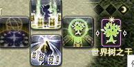

# 最终幻想14一键连击生成器
FFXIV one button combo based on Triggernometry and PostNamazu
### 地址: [[点击这里](https://ffxiv-one-button-combo.vercel.app/)] [[或者这里](https://yuee98.github.io/FFXIVOneButtonCombo/)]

### 视频预览: [[bilibili](https://www.bilibili.com/video/BV1av411L7xG)]

### 6.0 更新: 国服开放6.0后根据我满级的进度更新
- ~~召唤、武僧因为技能大改，暂时没更新，等我满级练练看再说~~ 写完了
- ~~诗人职业量谱时长变了，需要重新写正则，暂时没时间~~ 写完了，90大招等满级看看能不能也加进去
- ~~钐镰客只做了基本的练级做完了80级以下循环，86技能还没放进去，也是等满级再继续写~~ 写完了
- ~~占星技能大改，有空再看看还需不需要自动发卡~~ 写完了
- **有前缀※的连击需要添加对应职业的基础触发器(※)，** 例如忍者的 "**※普通-风遁连**" 需要添加 "**忍者-基础(※)**"
****

## 功能
将连击或有绑定关系的多个技能放置在同一个键位

## 特点介绍
- **低耦合度，所有按键独立设置，仅修改当前按键，可自行选择需要使用的按键**
- 基于鲶鱼精邮差，技能正常进入队列，且不会打断游戏内宏的运行
- 所有按键均使用/hotbar set放置，无需占用额外按键栏
- 一定程度的异常处理
- 带有等级判断，不够等级的技能自动跳过
- 支持键盘和手柄按键

## 使用方法
0. 安装ACT，
[Triggernometry](https://github.com/paissaheavyindustries/Triggernometry)
和
[PostNamazu](https://github.com/Natsukage/PostNamazu/) ([鲶鱼精邮差](https://nga.178.com/read.php?tid=19724323))
插件，其中**Triggernometry版本需要大于(不能等于) 1.1.3.1**

1. [[点击这里](https://ffxiv-one-button-combo.vercel.app/)] [[或者这里](https://yuee98.github.io/FFXIVOneButtonCombo/)]

2. 选择职业和连击

    

3. 选择设置该连击的键位和操作方式，点击生成

    

4. 复制到剪切板，导入Triggernometry

    

## 关于复位
每个键位都有自动复位功能，进本、团灭、切换地图时自动重置

## 职业说明

骑士

<ul>
<li>王权连、沥血连和AOE连<ul>
<li>连击合并，中断15s自动复位</li>
<li>带有等级判断</li>
</ul>
</li>
<li>王权赎罪连<ul>
<li>将王权连和赎罪合并至一个键位</li>
<li>支持拆赎罪</li>
</ul>
</li>
<li>安魂-悔罪<ul>
<li>安魂期间安魂自动替换为悔罪</li>
</ul>
</li>
<li>
预览

</li>
</ul>

战士

<ul>
<li>绿斩连、红斩连和AOE连<ul>
<li>连击合并，中断15s自动复位</li>
<li>带有等级判断</li>
</ul>
</li>
<li>解放-锯爆<ul>
<li>解放期间解放自动替换为裂石飞环</li>
</ul>
</li>
<li>
预览

</li>
</ul>

黑骑

<ul>
<li>基础连击和AOE连<ul>
<li>连击合并，中断15s自动复位</li>
<li>带有等级判断</li>
</ul>
</li>
<li>血乱-拜年<ul>
<li>血乱期间血乱<del>解放</del>自动替换为拜年剑法</li>
</ul>
</li>
<li>精雕-海胆<ul>
<li>打完精雕10s内替换为海胆</li>
<li><del>为了手柄一页放下常用技能强行凑的</del></li>
</ul>
</li>
<li>
预览

</li>
</ul>

绝枪

<ul>
<li>基础连击、子弹连与AOE连<ul>
<li>连击合并，中断15s自动复位</li>
<li>带有等级判断</li>
</ul>
</li>
<li>AOE+子弹<ul>
<li>把AOE二连和命运之环合并</li>
<li><del>一般用不到</del></li>
</ul>
</li>
<li>无情-音速破<ul>
<li>无情期间无情自动替换为音速破</li>
</ul>
</li>
<li>
预览

</li>
</ul>

 

龙骑

<ul>
<li>直刺连、樱花连<ul>
<li>连击合并，包括四连（123+龙4/龙5）</li>
<li>带有等级判断</li>
<li>断龙血时也可以正常连击</li>
</ul>
</li>
<li>AOE连击<ul>
<li>连击合并，中断15s自动复位</li>
<li>带有等级判断</li>
</ul>
</li>
<li>高跳-幻想冲<ul>
<li>高跳后替换为幻象冲</li>
</ul>
</li>
<li>
预览

</li>
</ul>

忍者

<ul>
<li>普通连、风遁连和AOE连<ul>
<li>连击合并，中断15s自动复位</li>
<li>带有等级判断</li>
</ul>
</li>
<li>三段-断绝<ul>
<li>三段后替换为断绝</li>
</ul>
</li>
<li>影牙-背刺、天地人-命水<ul>
<li>水遁期间替换天地人为命水、影牙为背刺</li>
</ul>
</li>
<li>天、地、人之印<ul>
<li>打完对应引后替换为忍术</li>
<li>但是结印cd太短，连打会导致替换前就进队列，仍然会搓出来兔子</li>
</ul>
</li>
<li>
预览

  

</li>
</ul>

武僧

<ul>
<li>背身位、侧身位与AOE连击<ul>
<li>连击合并，中断15s自动复位</li>
<li>根据身形切换技能</li>
<li>震脚时切换为爆发技能</li>
</ul>
</li>
<li>一键军体拳<ul>
<li>自动根据DoT和buff时间判断打什么拳</li>
<li>适配震脚爆发</li>
<li>基于标准循环，每次震脚爆发会切换正打/反打军体拳，可自行打正拳/双掌打调整</li>
<li>循环参考<a href="https://img.nga.178.com/attachments/mon_202101/31/-7s28Q8fo8-humqZeT3cSlb-sg.jpg">这里</a></li>
</ul>
</li>
<li>
预览

  

</li>
</ul>

武士

<ul>
<li>雪、月、花三连与AOE连击<ul>
<li>连击合并，中断15s自动复位</li>
<li>带有等级判断</li>
<li>明镜时替换为雪、月、花</li>
<li>月连、花连带有防蠢机制，打重复闪时给你叶隐救急</li>
</ul>
</li>
<li>心眼-慈眼、震天-星眼<ul>
<li>触发心眼后替换心眼为慈眼、震天为星眼</li>
</ul>
</li>
<li>默想-照破<ul>
<li>三层默想时替换默想为照破</li>
</ul>
</li>
<li>
预览

</li>
</ul>

诗人

<ul>
<li>强力-辉煌<ul>
<li>触发辉煌时自动替换</li>
</ul>
</li>
<li>歌曲循环<ul>
<li>简单的三首歌循环</li>
<li>放浪曲时替换为完美音调</li>
<li>放浪曲后替换为贤者谣</li>
<li>贤者谣时/后替换为军神歌</li>
<li>军神歌时/后、默认状态下替换为防浪曲</li>
<li>基于职业量谱判断</li>
</ul>
</li>
<li>
预览

</li>
</ul>

机工

<ul>
<li>普通连击<ul>
<li>连击合并，中断15s自动复位</li>
<li>支持低级连击和热弹连击</li>
<li>带有等级判断</li>
</ul>
</li>
<li>超荷-热冲击、散射-自动弩<ul>
<li>过热状态下替换超荷为热冲击、散射为自动弩</li>
</ul>
</li>
<li>炮塔-自爆<ul>
<li>放下炮塔/机器人后，按键变为提前自爆</li>
</ul>
</li>
<li>钻-锚<ul>
<li>把钻头和空气锚当做二连击合并</li>
<li><del>凑数用的，不推荐</del></li>
</ul>
</li>
<li>
预览

</li>
</ul>

舞者

<ul>
<li>逆-瀑泻、坠-喷泉、升-风车、落-血雨、扇舞序-急、扇舞破-急<ul>
<li>连击不合并</li>
<li>触发时自动替换 (SR-&gt;S1, S3-&gt;S2, AR-&gt;A1, A3-&gt;A2, F3-&gt;F1, F3-&gt;F2)</li>
</ul>
</li>
<li>标准舞步、技巧舞步<ul>
<li>一键跳舞</li>
<li>判断基于职业量谱</li>
<li>中断跳舞自动复位</li>
</ul>
</li>
<li>
预览

</li>
</ul>

黑魔

<ul>
<li>火3-冰3、异言-绝望<ul>
<li>火状态下替换为冰3、绝望</li>
<li>冰状态下替换为火3、异言</li>
<li>基于职业量谱判断，兼容各种循环</li>
<li>可自行修改对应技能，添加新的 冰-火 技能对</li>
</ul>
</li>
<li>暴雷-火1<ul>
<li>同上</li>
<li>触发火苗时会自动替换为火3</li>
</ul>
</li>
<li>天语-冰4-火4<ul>
<li>无天语时替换为天语</li>
<li>火状态下替换为火4</li>
<li>冰状态下替换为冰4</li>
<li><del>基本复刻了pvp的天语技能</del></li>
<li>72级以上，读条火4时，mp不足会自动替换为绝望（避免犯蠢不够蓝打绝望）</li>
</ul>
</li>
<li>
预览

</li>
</ul>

召唤

<ul>
<li>一键附体<ul>
<li>互锁的技能全部一个键位（附体-核爆-巴哈-喷-不死鸟-喷）</li>
<li>基于职业量谱判断，兼容各个等级各个循环</li>
</ul>
</li>
<li>鸟1-鸟2<ul>
<li>鸟1鸟2自动替换</li>
<li>鸟状态结束时自动替换为毁2</li>
</ul>
</li>
<li>吸收-溃烂、抽取-核爆<ul>
<li>有以太时替换吸收为溃烂，抽取替换为痛苦核爆</li>
</ul>
</li>
<li>即刻复活<ul>
<li>地球人都懂</li>
</ul>
</li>
<li>
预览

  

</li>
</ul>

赤魔

<ul>
<li>魔三连<ul>
<li>连击合并，中断15s自动复位</li>
<li>支持低级连击和魔连击</li>
<li>带有等级判断</li>
</ul>
</li>
<li>石-风、火-雷<ul>
<li>根据顺发状态自动选择</li>
<li>魔三连后替换为赤神圣/核爆</li>
</ul>
</li>
<li>风雷AOE-散碎<ul>
<li>根据顺发状态自动选择</li>
</ul>
</li>
<li>即刻复活<ul>
<li>地球人都懂</li>
</ul>
</li>
<li>
预览

</li>
</ul>

白魔

<ul>
<li>即刻复活<ul>
<li>地球人都懂</li>
</ul>
</li>
<li>
预览

</li>
</ul>

学者

<ul>
<li>以太-吸收<ul>
<li>以太期间替换以太为吸收</li>
</ul>
</li>
<li>祥光-慰藉<ul>
<li>大天使期间替换异想的祥光为慰藉</li>
</ul>
</li>
<li>即刻复活<ul>
<li>地球人都懂</li>
</ul>
</li>
<li>
预览

</li>
</ul>

占星

<ul>
<li>抽卡-重抽、出卡-小奥秘卡<ul>
<li>持有卡片花色不重复、或无持有卡片时替换为抽卡、出卡</li>
<li>卡片花色重复则替换为重抽、小奥秘卡</li>
<li>基于职业量谱判断，袖内抽的卡也有效</li>
</ul>
</li>
<li>自动发卡(测试)<ul>
<li>根据自行设定的优先级自动发卡</li>
<li>花色重复时会自动改发小奥秘卡</li>
<li>根据职业远近发对应卡</li>
<li>避免同一角色卡片覆盖</li>
<li>详细设置见<a href="./docs/ast_auto_play.md">这里</a></li>
</ul>
</li>
<li>即刻复活<ul>
<li>地球人都懂</li>
</ul>
</li>
<li>
预览

</li>
</ul>

