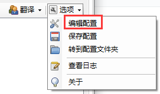
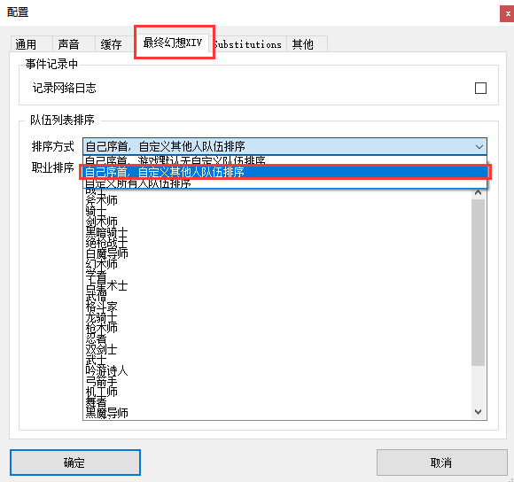
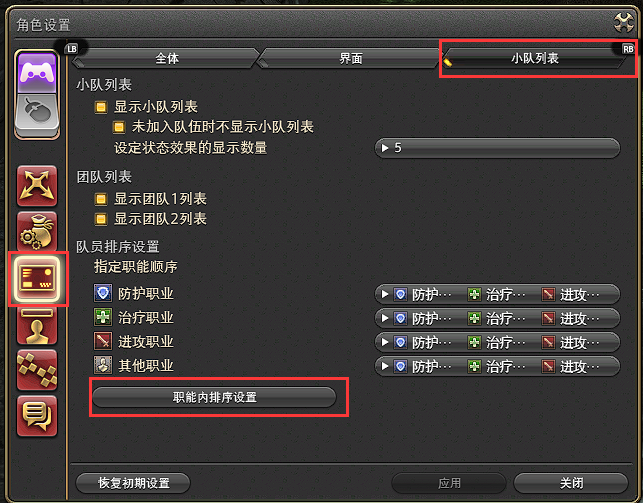
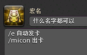

# 占星自动发卡

## 功能
- 根据自行设定的优先级自动发卡
- 花色重复时会自动改发小奥秘卡
- 根据职业远近发对应卡
- 避免同一角色卡片覆盖

## 使用方法
1. 根据
[这里](https://github.com/Yuee98/FFXIVOneButtonCombo/blob/main/docs/README_cdn.md#%E4%BD%BF%E7%94%A8%E6%96%B9%E6%B3%95)
的说明导入触发器

2. 打开ACT的Triggernometry插件页面，点击右上角 [ **选项** ] - [ **编辑配置** ]

    

3. 在 [ **最终幻想XIV** ] 选项卡中，设置 [ **排序方式** ] 为 [ **自己序首，自定义其他人队伍排序** ]

    

4. 调整上图 [ **职业排序** ] 中职业的顺序，使其和游戏里下图所示职业顺序保持一致

    

5. 在战斗开始前，在游戏内聊天框内按以下格式输入队友发卡顺序进行初始化
    > /e s{优先级1}{优先级2}{优先级3}{优先级4}

    例如，输入
    > /e s5678

    代表发卡时，将优先发给编号为5的队友，如果卡片远近类型不符合，或者该队友已经有卡，则会顺延至编号为6的队友，以此类推

    初始化成功时，聊天框内会显示
    > 优先级 5->6->7->8

    确保输入4个优先级，队伍不足四人时可重复某队友编号

6. 在游戏内编写发卡宏，如下图所示

    

7. 组队进入战斗，测试一下吧，需要发卡时，按上图的宏就可以，发卡时聊天框内会显示
    > 自动出卡 -> {职业缩写} {玩家名称}

    如
    > 自动出卡 -> SAM 丝瓜卡夫卡·拂晓之间

    注意该触发器使用了 **文本指令 /ac** 进行发卡，无法进入技能队列，可能需要多按几次确保技能正常释放

